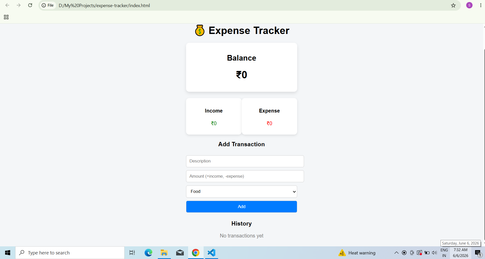

# Expense Tracker
A simple and user-friendly Expense Tracker web application built using HTML, CSS, and JavaScript.
## Screenshot

## Features
- Add income and expense transactions
- Automatic balance calculation
- Track total income and expenses
- Categorize transactions
- View transaction history
- Clean and responsive user interface

## Technologies Used
- HTML5
- CSS3
- JavaScript
